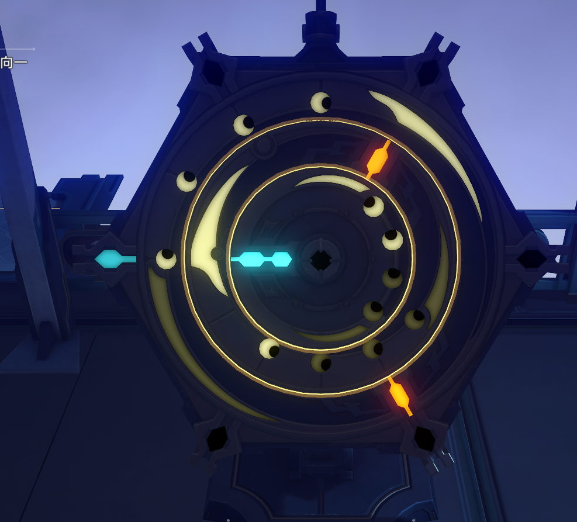

##### 示例图

示例初始图如下：

##### 数学建模

首先，按照由内而外的顺序，将盘圈标序为：
$$
\{c_1, c_2, \dots, c_n\}
$$
单次最小转动角度记为：
$$
j=\frac{\pi}{3}
$$
基于此，以左侧为极轴，顺时针为正序，给出罗盘初始状态：
$$
jB=j
\begin{bmatrix}
0\\2\\4
\end{bmatrix}
$$
将每圈的最小转动角度记为如下向量：
$$
M=j
\begin{bmatrix}
-2\\1\\4
\end{bmatrix}
$$
将每个转动操作表示为向量，如下述向量分别为本实例图的三种操作，内中联动、内外联动和中外联动：
$$
L_1=\begin{bmatrix}
1\\1\\0
\end{bmatrix}
\quad
L_2=\begin{bmatrix}
1\\0\\1
\end{bmatrix}
\quad
L_3=\begin{bmatrix}
0\\1\\1
\end{bmatrix}
$$
可以给出转动方程如下：
$$
L=
\begin{bmatrix}
L_1, L_2, L_3
\end{bmatrix}
\\
jB+jM\cdot Lx=6jIK
\\
M\cdot Lx=6K-B
$$
其中，$I$ 为三阶单位方阵，$K$ 为任意整数值三维向量。

于是问题转换为求解上述方程，并尽可能使得 $||x||$ 最小。

##### 试解决本例（失败）

首先有方程如下：
$$
\begin{bmatrix}
-2\\1\\4
\end{bmatrix}
\cdot
\begin{bmatrix}
1&1&0\\
1&0&1\\
0&1&1\\
\end{bmatrix}
\begin{bmatrix}
x_1\\x_2\\x_3
\end{bmatrix}
=
6
\begin{bmatrix}
k_1\\k_2\\k_3
\end{bmatrix}
-
\begin{bmatrix}
0\\2\\4
\end{bmatrix}
$$
将右侧除以 $M$：
$$
Lx=
\begin{bmatrix}
-3k_1\\
6k_2-2\\
3k_3/2-1\\
\end{bmatrix}
$$
由于右侧为整数向量，且 $K$ 为任意整数向量，于是有：
$$
Lx=
\begin{bmatrix}
3k_1\\
6k_2-2\\
3k_3/2-1\\
\end{bmatrix}
\\
L^{-1}=
\begin{bmatrix}
0.5&0.5&-0.5\\
0.5&-0.5&0.5\\
-0.5&0.5&0.5\\
\end{bmatrix}
\\
x=
\begin{bmatrix}
-1.5+1.5k_1+3k_2-0.75k_3\\
0.5+1.5k_1-3k_2+0.75k_3\\
-0.5-1.5k_1+3k_2+0.75k_3
\end{bmatrix}
\\
x=
\begin{bmatrix}-0.5\\0.5\\-1.5\\\end{bmatrix}
+
\begin{bmatrix}
1.5&3&-0.75\\
1.5&-3&0.75\\
-1.5&3&0.75\\
\end{bmatrix}K
$$
只需令 $x$ 中元素均为非负整数即可。

然而似乎更复杂了。

##### 暴力求解

[实例链接](./test.jl)

先按最小正数来
$$
k_3=2\\
$$

